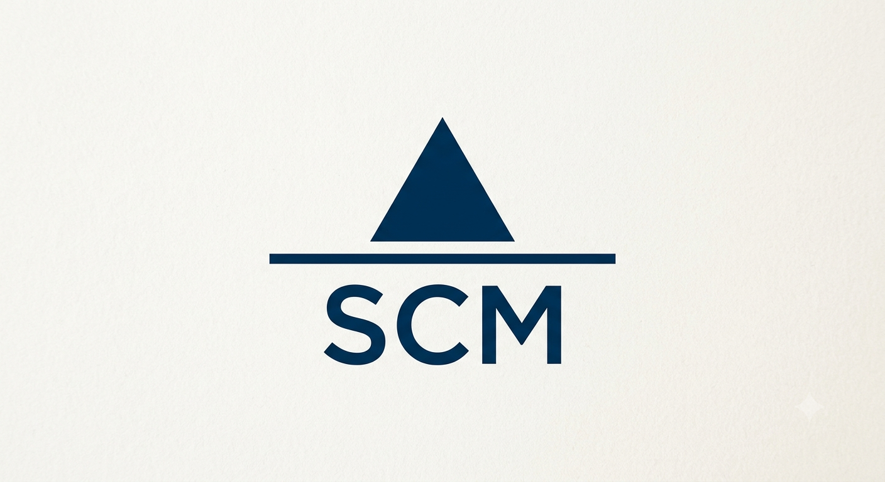
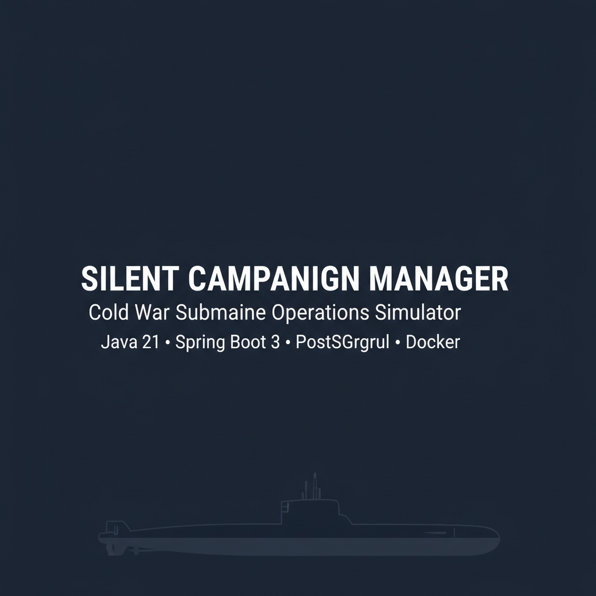
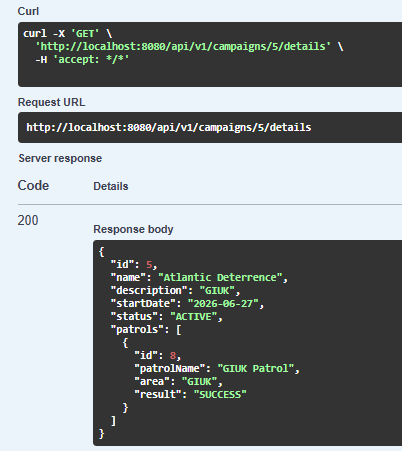
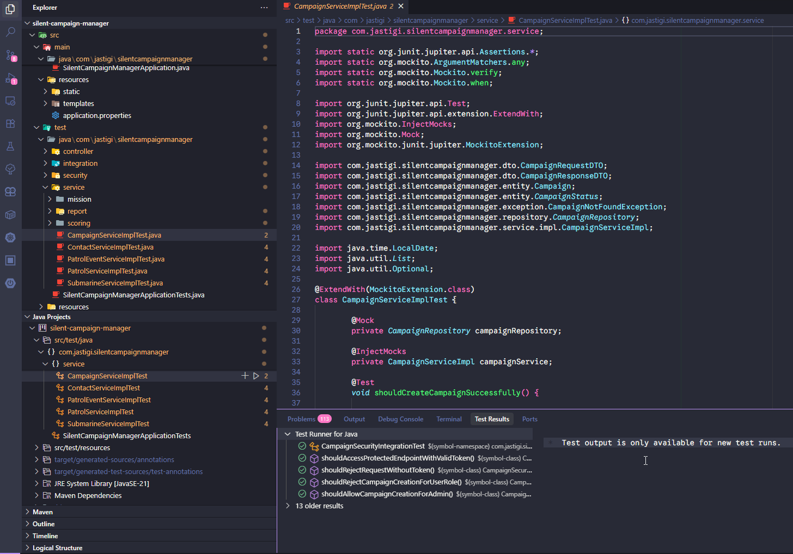
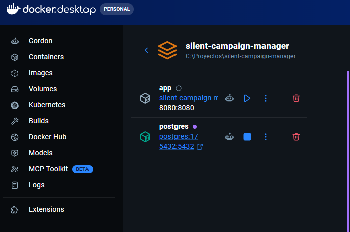
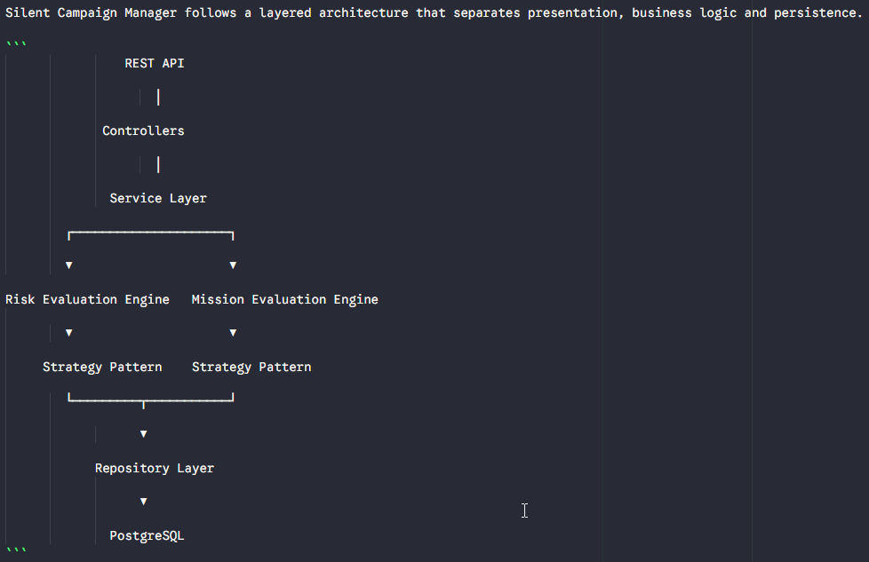

<p align="center">
  
</p>



# Silent Campaign Manager

> **Cold War Submarine Operations Simulator**

A backend application built with **Java 21** and **Spring Boot** for managing and simulating Cold War submarine operations.

The project combines a modern REST API with extensible simulation engines capable of evaluating tactical risk, mission success and submarine patrols using clean architecture and design patterns.

<p align="center">


</p>

## Table of Contents

- [Overview](#overview)
- [Features](#features)
- [Architecture](#architecture)
- [Technology Stack](#technology-stack)
- [Project Structure](#project-structure)
- [Simulation Engines](#simulation-engines)
- [Getting Started](#getting-started)
- [API Documentation](#api-documentation)
- [Testing](#testing)
- [Roadmap](#roadmap)
- [Screenshots](#screenshots)
- [License](#license)

## Overview

Silent Campaign Manager is inspired by Cold War submarine operations and naval warfare simulations.

Unlike a traditional CRUD application, the project is evolving into a modular simulation platform capable of evaluating patrol missions, tactical situations and contact risk through extensible rule engines.

The architecture has been designed to be scalable, testable and easy to extend with future simulation mechanics.

---

## Features

### Domain Management

- Campaign management
- Patrol management
- Submarine management
- Contact tracking
- Patrol event management

### Simulation

- Contact Risk Evaluation Engine
- Mission Evaluation Engine
- Strategy-based business rules

### Backend

- REST API
- Validation
- Exception handling
- DTO mapping
- Swagger documentation

---

## Technology Stack

| Technology        | Purpose               |
| ----------------- | --------------------- |
| Java 21           | Programming Language  |
| Spring Boot       | Backend Framework     |
| Spring Data JPA   | Persistence           |
| Hibernate         | ORM                   |
| PostgreSQL        | Database              |
| Docker Compose    | Local Infrastructure  |
| Maven             | Build Tool            |
| Lombok            | Boilerplate Reduction |
| Swagger / OpenAPI | API Documentation     |
| JUnit 5           | Testing               |
| Mockito           | Unit Testing          |

---

## Architecture

## Architecture

The project follows a layered architecture with a strong separation between business logic and infrastructure.

For more details see:

📄 **docs/architecture.md**

## Domain Model

The simulation is centered around patrols.

Each patrol belongs to a campaign and generates contacts and events that are later evaluated by specialized simulation engines.

See:

📄 **docs/domain-model.md**

---

## Simulation Engines

Silent Campaign Manager currently includes two independent simulation engines.

### Contact Risk Evaluation Engine

Calculates the tactical risk associated with detected contacts using configurable Strategy Pattern implementations.

### Mission Evaluation Engine

Evaluates patrol success according to the assigned mission and the contacts generated during the patrol.

Both engines have been designed to be easily extensible without modifying existing business logic.

## Project Structure

```text
src
├── config
├── controller
├── dto
├── entity
├── exception
├── mapper
├── repository
├── service
│   ├── mission
│   │   ├── engine
│   │   └── strategy
│   ├── scoring
│   │   └── strategy
│   └── ...
└── resources

docs
├── architecture.md
├── domain-model.md
├── images
└── decisions
```

The project is organized following a layered architecture that clearly separates presentation, business logic, persistence and simulation engines.

## Getting Started

### Prerequisites

Before running the project, make sure you have installed:

- Java 21
- Docker Desktop
- Git

The project includes the Maven Wrapper, so no Maven installation is required.

---

### Clone the repository

```bash
git clone https://github.com/YOUR_USERNAME/silent-campaign-manager.git

cd silent-campaign-manager
```

---

### Start PostgreSQL

```bash
docker compose up -d
```

Verify that the PostgreSQL container is running.

---

### Run the application

Windows

```bash
mvnw.cmd spring-boot:run
```

Linux / macOS

```bash
./mvnw spring-boot:run
```

The application will be available at:

```
http://localhost:8080
```

## API Documentation

Once the application is running, Swagger UI is available at:

```
http://localhost:8080/swagger-ui/index.html
```

The OpenAPI documentation is generated automatically.



## Testing

The project includes automated tests covering the most important business components.

Current test coverage includes:

- Service layer
- REST controllers
- Simulation engines
- Risk calculation
- Mission evaluation

Run all tests:

```bash
mvnw test
```

Expected output:

```text
BUILD SUCCESS

Tests run: XXX

Failures: 0

Skipped: 0
```



## Current Status

### Implemented

- Campaign Management
- Patrol Management
- Contact Management
- Patrol Events
- Submarine Management
- Contact Risk Evaluation Engine
- Mission Evaluation Engine
- PostgreSQL Persistence
- Docker Support
- REST API
- Swagger Documentation

### Under Development

- Campaign Simulation
- Dynamic Mission Scoring
- Authentication & Authorization
- Tactical Combat

## Roadmap

### Version 0.8

- Mission Evaluation Engine
- Strategy Pattern refactoring
- Patrol contacts

### Version 0.9

- Campaign Simulation Engine
- Dynamic Patrol Resolution
- Tactical Events

### Version 1.0

- Cold War Campaign Simulator
- NATO vs Warsaw Pact
- Advanced Statistics
- AI-assisted Mission Evaluation

## Screenshots

### Swagger UI


---

### Docker



---

### Architecture



## Future Vision

Silent Campaign Manager aims to evolve into a modular simulation platform capable of reproducing Cold War submarine operations through extensible rule-based engines.

Future versions will introduce:

- Dynamic sonar detection
- Weapon engagement
- Strategic campaign progression
- NATO and Warsaw Pact doctrine
- AI-assisted mission planning
- Advanced operational statistics

## About the Author

**Jorge Martínez Juan**

Backend Developer passionate about Java, software architecture and naval warfare simulations.

GitHub

https://github.com/jastigi

LinkedIn

https://www.linkedin.com/in/jorgemartinezjuan

## Contributing

Contributions, suggestions and constructive feedback are always welcome.

If you would like to discuss new features or improvements, feel free to open an issue.

## License

This project is licensed under the MIT License.

See the LICENSE file for more information.
