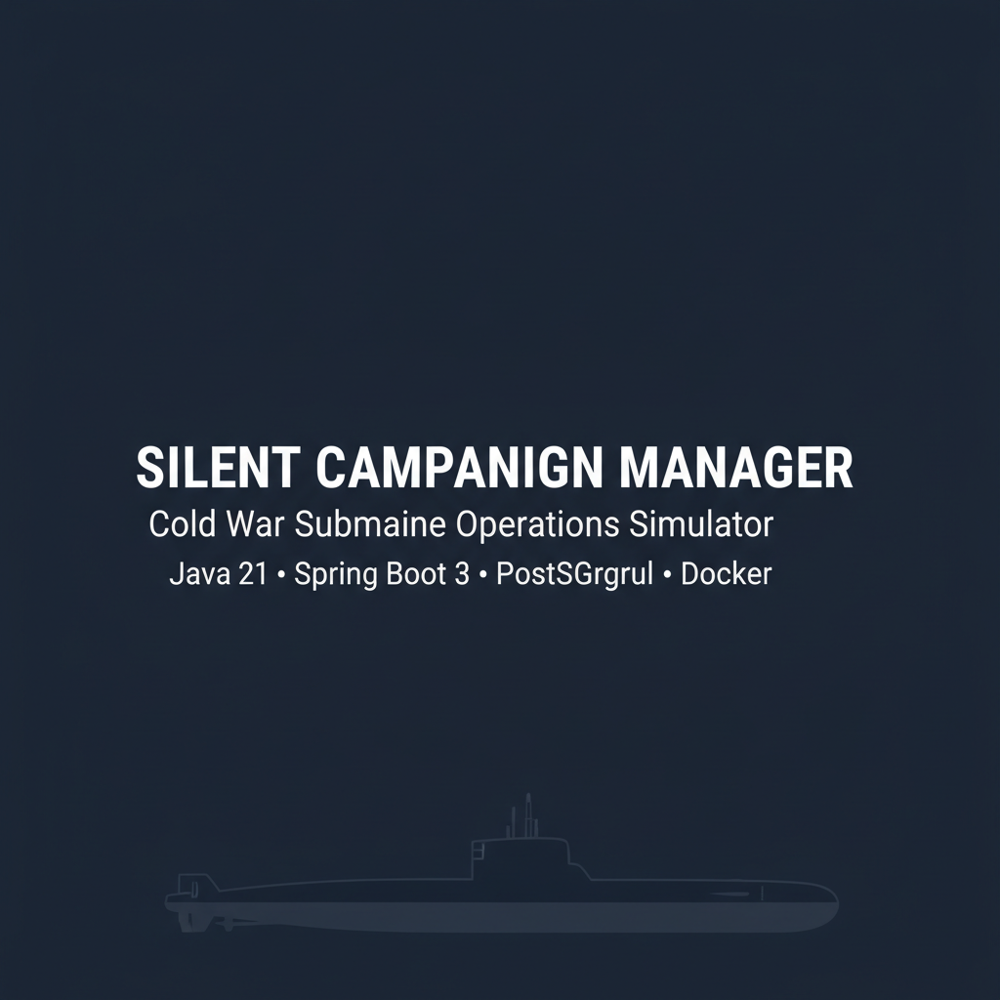
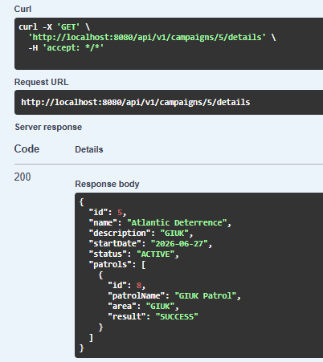
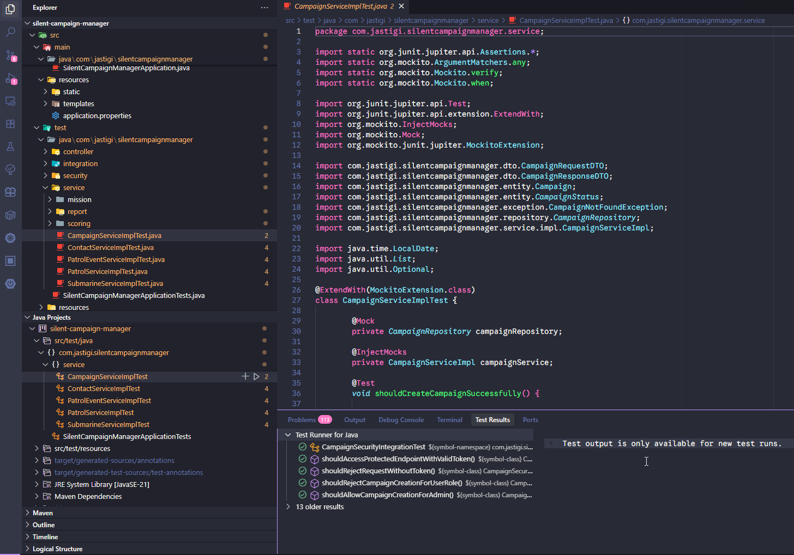
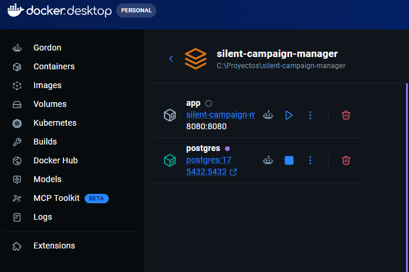
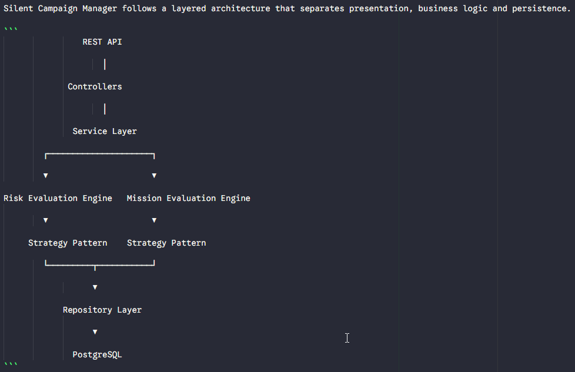

<p align="center">
  
</p>



# Silent Campaign Manager

> **A modular backend platform for Cold War submarine campaign management and tactical simulation.**

[](https://github.com/jastigi/silent-campaign-manager/releases)


A backend application built with **Java 21** and **Spring Boot 3.5** for managing and simulating Cold War submarine operations.

Silent Campaign Manager has evolved from a traditional CRUD application into a modular backend platform that combines:

- campaign management;
- tactical patrol simulation;
- campaign progression;
- campaign lifecycle management;
- operational statistics;
- JWT-secured REST APIs;
- PostgreSQL persistence;
- an extensible tactical simulation engine.

The simulation engine resolves complete submarine patrols through ordered tactical phases including environmental modelling, sonar detection, contact classification, tactical behaviour, tracking, intelligence gathering, mission evaluation and automatic persistence.

---

## Project Highlights

- Cold War submarine campaign simulator
- Java 21 & Spring Boot 3.5
- Modular tactical simulation engine
- Campaign lifecycle management
- JWT-secured REST API
- PostgreSQL persistence
- OpenAPI / Swagger documentation
- Docker Compose ready
- 350+ automated tests
- Architecture Decision Records (ADR)

---

## Current Project Status

| Release | Status         |
| ------- | -------------- |
| 0.9     | ✅ Completed   |
| 1.0     | 🚧 In Progress |

Current implementation includes:

- Tactical Simulation Engine
- Campaign Simulation
- Campaign Progress
- Campaign Statistics
- Campaign Lifecycle
- Lifecycle REST API
- JWT Authentication
- Swagger / OpenAPI
- Docker Compose
- PostgreSQL persistence
- 350+ automated tests

The detailed development roadmap is available in:

```text
docs/development-roadmap.md
```

---

## Table of Contents

- [Current Project Status](#current-project-status)
- [Documentation](#documentation)
- [Release Status](#release-status)
- [Features](#features)
- [Architecture](#architecture)
- [Technology Stack](#technology-stack)
- [Simulation Engine](#simulation-engine)
- [Project Structure](#project-structure)
- [Getting Started](#getting-started)
- [Authentication](#authentication)
- [API Documentation](#api-documentation)
- [REST API Overview](#rest-api-overview)
- [Testing](#testing)
- [Roadmap](#roadmap)
- [Screenshots](#screenshots)
- [Future Vision](#future-vision)
- [Contributing](#contributing)
- [License](#license)
- [About the Author](#about-the-author)

---

## Documentation

The project documentation is organised under the `docs` directory.

| Document                 | Description                     |
| ------------------------ | ------------------------------- |
| `architecture.md`        | High-level system architecture  |
| `domain-model.md`        | Domain model overview           |
| `simulation-engine.md`   | Tactical simulation engine      |
| `campaign-lifecycle.md`  | Campaign lifecycle design       |
| `development-roadmap.md` | Complete implementation roadmap |
| `release-notes/`         | Release history                 |
| `adr/`                   | Architecture Decision Records   |

---

## Overview

Silent Campaign Manager is inspired by Cold War submarine operations and naval warfare simulations.

Unlike a traditional CRUD application, it provides a modular simulation platform capable of:

- managing campaigns, submarines, patrols, contacts and patrol events;
- evaluating patrol missions through mission-specific strategies;
- executing complete tactical patrol simulations;
- modelling environmental and sonar conditions;
- persisting completed simulation results;
- consulting a paginated operational history;
- protecting the REST API with JWT authentication.

The architecture is designed to remain testable and extensible as new tactical mechanics are introduced.

---

## Release Status

Silent Campaign Manager follows an incremental release strategy where each version delivers a complete architectural milestone.

The project is currently progressing through **Release 1.0**, which builds on the tactical simulation engine introduced in Release 0.9.

---

### Release 0.9 — Tactical Simulation Engine

**Status**

✅ Completed

Main achievements:

- Complete tactical simulation pipeline
- Environmental modelling
- Passive and active sonar
- Contact detection and classification
- Contact tactical behaviour
- Shadowing and tracking
- Contact-loss resolution
- Intelligence gathering
- Mission-specific tactical evaluation
- Mission scoring and debriefing
- Automatic simulation persistence
- Paginated simulation history
- Patrol simulation history

Release documentation:

```text
docs/release-notes/0.9.md
```

---

### Release 1.0 — Campaign Engine

**Status**

🚧 In Progress

Completed milestones:

- Campaign Simulation
- Campaign Progress
- Campaign Statistics
- Campaign Lifecycle
- Campaign Lifecycle REST API
- Campaign execution validation

Current architecture:

```text
Campaign
      │
      ▼
Campaign Simulation
      │
      ▼
Simulation Engine
      │
      ▼
Simulation Persistence
      │
      ▼
Campaign Progress
      │
      ▼
Campaign Statistics
```

Remaining planned milestones include:

- Dynamic campaign events
- Strategic campaign evolution
- Operational AI
- Strategic AI
- Doctrine modelling

Release documentation:

```text
docs/release-notes/1.0.md
```

---

### Development Strategy

Every release is developed following the same principles:

- incremental delivery;
- documented architecture decisions (ADR);
- automated testing;
- backward compatibility;
- complete release notes;
- roadmap-driven implementation.

This approach allows each release to remain stable while progressively extending the tactical and campaign capabilities of the platform.

---

## Features

### Campaign Management

- Create, update and delete submarine campaigns
- Campaign detail view
- Campaign status management
- Campaign lifecycle transitions
- Campaign execution validation
- Campaign progression tracking
- Campaign statistics
- Campaign search and pagination

---

### Patrol Management

- Patrol creation and assignment
- Patrol scheduling
- Mission type management
- Operational area definition
- Patrol history
- Ordered campaign execution

---

### Tactical Simulation Engine

- Environmental modelling
- Passive sonar detection
- Active sonar detection
- Contact classification
- Contact tactical behaviour
- Contact tracking
- Contact-loss resolution
- Intelligence gathering
- Mission evaluation
- Mission scoring
- Automatic simulation persistence

---

### Campaign Simulation

- Campaign orchestration
- Sequential patrol execution
- Campaign simulation results
- Automatic campaign progress calculation
- Aggregated campaign statistics
- Lifecycle-aware execution
- Execution validation before simulation
- Campaign execution persistence
- Failed execution audit records

---

### Security

- Spring Security
- JWT authentication
- Protected REST endpoints
- Role-based authorization
- Global exception handling

---

### REST API

- OpenAPI / Swagger documentation
- Pagination support
- Search endpoints
- Campaign lifecycle endpoints
- Campaign statistics endpoints
- Simulation endpoints
- Validation with Bean Validation

---

### Persistence

- PostgreSQL
- Spring Data JPA
- Hibernate ORM
- Repository pattern
- Transactional services
- Simulation history persistence
- Campaign execution history foundation

---

### Quality

- Layered architecture
- SOLID-oriented design
- Service separation by domain
- Architecture Decision Records (ADR)
- Release Notes
- Development Roadmap
- 350+ automated tests

---

## Architecture

Silent Campaign Manager follows a layered architecture where campaign orchestration, tactical simulation and persistence are clearly separated into independent services.

This separation keeps the tactical simulation engine reusable while allowing campaign-specific functionality to evolve independently.

---

### High-Level Architecture

```text
                REST API
                    │
                    ▼
        Campaign Management Layer
                    │
     ┌──────────────┼──────────────┐
     ▼              ▼              ▼
Campaign      Campaign        Campaign
Lifecycle     Simulation      Statistics
                    │
                    ▼
          Tactical Simulation Engine
                    │
                    ▼
        Simulation Persistence Layer
                    │
                    ▼
             Spring Data JPA
                    │
                    ▼
               PostgreSQL
```

The campaign layer coordinates business operations while the tactical simulation engine remains independent of campaign management.

---

### Campaign Execution Flow

```text
Campaign
    │
    ▼
CampaignSimulationService
    │
    ▼
CampaignLifecycleService
    │
    ▼
SimulationService
    │
    ▼
SimulationEngine
    │
    ▼
SimulationPersistenceService
    │
    ▼
CampaignProgressService
    │
    ▼
CampaignStatisticsService
```

This orchestration ensures that campaign progression and statistics are derived from persisted tactical simulation results.

---

### Domain Separation

The application is organised around three main domains.

| Domain              | Responsibility                                                                |
| ------------------- | ----------------------------------------------------------------------------- |
| Campaign            | Campaign lifecycle, orchestration, progression and statistics                 |
| Tactical Simulation | Patrol simulation, sonar modelling, contact resolution and mission evaluation |
| Infrastructure      | Persistence, security, REST API, OpenAPI, Docker and PostgreSQL               |

This separation allows campaign functionality to evolve without introducing campaign-specific behaviour into the tactical simulation engine.

---

### Architectural Principles

The project follows these design principles:

- Layered Architecture
- Single Responsibility Principle
- Dependency Injection
- Repository Pattern
- Domain-oriented services
- Pipeline Pattern for tactical simulation
- Strategy Pattern for mission evaluation
- Fail-fast validation
- DTO isolation between REST and persistence
- Architecture Decision Records

Further documentation:

```text
docs/architecture.md
docs/domain-model.md
docs/simulation-engine.md
docs/campaign-lifecycle.md
docs/development-roadmap.md
docs/adr/
```

---

## Technology Stack

| Category         | Technologies                       |
| ---------------- | ---------------------------------- |
| Language         | Java 21                            |
| Framework        | Spring Boot 3.5.x                  |
| Security         | Spring Security, JWT               |
| Persistence      | Spring Data JPA, Hibernate ORM     |
| Database         | PostgreSQL 17                      |
| Build Tool       | Maven Wrapper                      |
| Documentation    | SpringDoc OpenAPI (Swagger UI)     |
| Testing          | JUnit 5, Mockito, Spring Boot Test |
| Containerization | Docker, Docker Compose             |
| Development      | Lombok, Validation API             |

---

### Main Spring Modules

- Spring Boot Starter Web
- Spring Boot Starter Security
- Spring Boot Starter Validation
- Spring Boot Starter Data JPA
- Spring Boot DevTools
- SpringDoc OpenAPI
- PostgreSQL Driver

---

### Development Practices

- Layered architecture
- Constructor-based dependency injection
- DTO mapping
- Repository pattern
- Transactional services
- Bean Validation
- RESTful API design
- Incremental release strategy
- ADR-driven architectural evolution

---

### Build & Execution

Run the application:

```bash
./mvnw spring-boot:run
```

Run the complete test suite:

```bash
./mvnw test
```

Build the project:

```bash
./mvnw clean package
```

Run with Docker Compose:

```bash
docker compose up --build
```

---

## Simulation Engine

The tactical simulation engine is the core component of Silent Campaign Manager.

It executes submarine patrols through an ordered pipeline where each phase performs a single responsibility and updates a shared simulation context.

The engine is completely independent of campaign management, allowing tactical simulations to remain reusable while higher-level campaign services orchestrate execution.

---

### Tactical Simulation Pipeline

```text
Environment
      │
      ▼
Sonar Detection
      │
      ▼
Contact Classification
      │
      ▼
Contact Behaviour
      │
      ▼
Tracking
      │
      ▼
Contact Loss
      │
      ▼
Intelligence Gathering
      │
      ▼
Mission Evaluation
      │
      ▼
Simulation Persistence
```

Each phase:

- receives the current simulation context;
- performs a single tactical responsibility;
- appends structured simulation events;
- passes the updated context to the next phase.

---

### Campaign-Oriented Execution

Individual patrol simulations are orchestrated by the campaign layer.

```text
Campaign
      │
      ▼
CampaignSimulationService
      │
      ▼
CampaignLifecycleService
      │
      ▼
SimulationService
      │
      ▼
SimulationEngine
      │
      ▼
SimulationPersistenceService
      │
      ▼
CampaignProgressService
      │
      ▼
CampaignStatisticsService
```

Campaign services coordinate execution while the tactical simulation engine remains completely unaware of campaign lifecycle, progression and statistics.

---

### Simulation Result Flow

Once the tactical phases have completed, the generated result follows this processing chain.

```text
SimulationEngine
        │
        ▼
SimulationResult
        │
        ▼
TacticalMissionEvaluator
        │
        ▼
ResolvedSimulationResult
        │
        ▼
SimulationPersistenceService
        │
        ▼
SimulationRecordRepository
        │
        ▼
PostgreSQL
```

Persisted simulation records become the source of truth for:

- campaign progression;
- campaign statistics;
- simulation history;
- operational reports.

---

### Core Engine Characteristics

- Ordered execution pipeline
- Shared simulation context
- Independent simulation phases
- Structured tactical events
- Environmental modelling
- Passive and active sonar
- Contact classification
- Threat-based contact behaviour
- Contact tracking
- Contact-loss modelling
- Intelligence gathering
- Mission-specific evaluation strategies
- Automatic persistence
- Campaign-independent execution

---

### Simulation History

Completed simulations are persisted automatically and can be queried through the REST API.

```http
GET /api/v1/simulations/history
GET /api/v1/patrols/{patrolId}/simulations
```

Both endpoints support pagination.

Default ordering:

```text
recordedAt,DESC
```

Simulation history is later reused by campaign services to calculate progression and operational statistics.

---

## Project Structure

The project is organised around independent business domains while keeping the tactical simulation engine isolated from campaign-specific functionality.

```text
src
├── main
│   ├── java
│   │   └── com/jastigi/silentcampaignmanager
│   │
│   ├── config
│   ├── controller
│   ├── dto
│   ├── entity
│   ├── exception
│   ├── mapper
│   ├── repository
│   ├── security
│   │
│   └── service
│       ├── auth
│       ├── campaign
│       │   ├── lifecycle
│       │   ├── progress
│       │   ├── simulation
│       │   ├── statistics
│       │   └── execution
│       │
│       ├── contact
│       ├── missions
│       ├── patrol
│       ├── submarine
│       │
│       └── simulation
│           ├── calculator
│           ├── context
│           ├── engine
│           ├── evaluation
│           ├── generator
│           ├── history
│           ├── modifier
│           ├── persistence
│           ├── phase
│           ├── resolver
│           └── result
│
├── resources
│
└── test
    └── java
        └── com/jastigi/silentcampaignmanager
            ├── controller
            ├── integration
            ├── mapper
            ├── repository
            ├── security
            └── service
```

---

### Documentation

Project documentation is maintained alongside the source code.

```text
docs
├── adr
├── release-notes
├── architecture.md
├── campaign-lifecycle.md
├── development-roadmap.md
├── domain-model.md
├── simulation-engine.md
└── images
```

---

### Package Responsibilities

| Package              | Responsibility                       |
| -------------------- | ------------------------------------ |
| `controller`         | REST API endpoints                   |
| `dto`                | Request and response models          |
| `entity`             | JPA domain entities                  |
| `repository`         | Spring Data repositories             |
| `mapper`             | DTO ↔ Entity mapping                 |
| `security`           | JWT authentication and authorization |
| `service.campaign`   | Campaign orchestration and lifecycle |
| `service.simulation` | Tactical simulation engine           |
| `exception`          | Global exception handling            |
| `docs`               | Project documentation and ADRs       |

---

### Testing Structure

The test suite mirrors the production code.

Coverage currently includes:

- controller tests;
- repository tests;
- mapper tests;
- security tests;
- service tests;
- simulation engine tests;
- campaign lifecycle tests;
- campaign simulation tests;
- integration tests.

This structure allows each business domain to evolve independently while maintaining a consistent testing strategy.

---

## Getting Started

### Prerequisites

The project requires:

- Java 21
- Maven 3.9+ (or Maven Wrapper)
- Docker Desktop
- PostgreSQL 17 (if not using Docker)

---

### Clone the repository

```bash
git clone https://github.com/jastigi/silent-campaign-manager.git
cd silent-campaign-manager
```

---

### Start the infrastructure

The recommended way to run the application is with Docker Compose.

```bash
docker compose up -d
```

This starts:

- PostgreSQL
- Silent Campaign Manager

Verify that both containers are running before continuing.

---

### Run locally

If you prefer running the application from your IDE:

```bash
./mvnw spring-boot:run
```

or simply launch the Spring Boot application from your IDE.

---

### Execute the test suite

Run all automated tests:

```bash
./mvnw clean test
```

Run a specific test class:

```bash
./mvnw "-Dtest=CampaignLifecycleServiceImplTest" test
```

---

### Open Swagger UI

After the application has started:

```text
http://localhost:8080/swagger-ui/index.html
```

OpenAPI specification:

```text
http://localhost:8080/v3/api-docs
```

---

## Authentication

Silent Campaign Manager secures its REST API using JWT authentication.

### Authentication Flow

```text
Client
   │
   ▼
POST /api/v1/auth/login
   │
   ▼
JWT Token
   │
   ▼
Authorization: Bearer <token>
   │
   ▼
Protected REST Endpoints
```

---

### Login

Authenticate using:

```http
POST /api/v1/auth/login
```

The response contains a JWT access token.

---

### Swagger Authentication

1. Open Swagger UI.
2. Execute `POST /api/v1/auth/login`.
3. Copy the returned JWT token.
4. Click **Authorize**.
5. Enter:

```text
Bearer <your-token>
```

6. Execute any protected endpoint.

---

### Public Endpoints

The following routes remain publicly accessible:

```text
/api/v1/auth/**
/swagger-ui/**
/v3/api-docs/**
```

All remaining REST endpoints require a valid JWT.

> Development credentials are intended for local development only and should be replaced before deployment.

---

## API Documentation

The REST API is fully documented using SpringDoc OpenAPI.

Swagger UI:

```text
http://localhost:8080/swagger-ui/index.html
```

OpenAPI specification:

```text
http://localhost:8080/v3/api-docs
```

Swagger provides:

- endpoint documentation;
- request validation;
- response schemas;
- JWT authentication support;
- interactive endpoint execution.

The documentation is generated automatically from the Spring controllers and remains synchronized with the implementation.



---

## REST API Overview

The REST API is organised by business domain.

All protected endpoints require a valid JWT unless explicitly stated otherwise.

---

### Authentication

| Method | Endpoint             | Description                         |
| ------ | -------------------- | ----------------------------------- |
| POST   | `/api/v1/auth/login` | Authenticate and obtain a JWT token |

---

### Campaign Management

| Method | Endpoint                            | Description                   |
| ------ | ----------------------------------- | ----------------------------- |
| POST   | `/api/v1/campaigns`                 | Create a campaign             |
| GET    | `/api/v1/campaigns`                 | List campaigns                |
| GET    | `/api/v1/campaigns/paged`           | Paginated campaign list       |
| GET    | `/api/v1/campaigns/search`          | Search campaigns              |
| GET    | `/api/v1/campaigns/{id}`            | Get campaign details          |
| GET    | `/api/v1/campaigns/{id}/details`    | Extended campaign information |
| GET    | `/api/v1/campaigns/status/{status}` | Filter campaigns by status    |
| PUT    | `/api/v1/campaigns/{id}`            | Update a campaign             |
| DELETE | `/api/v1/campaigns/{id}`            | Delete a campaign             |

---

### Campaign Lifecycle

| Method | Endpoint                         | Description        |
| ------ | -------------------------------- | ------------------ |
| PATCH  | `/api/v1/campaigns/{id}/finish`  | Finish a campaign  |
| PATCH  | `/api/v1/campaigns/{id}/abandon` | Abandon a campaign |

---

### Campaign Analytics

| Method | Endpoint                            | Description         |
| ------ | ----------------------------------- | ------------------- |
| GET    | `/api/v1/campaigns/{id}/statistics` | Campaign statistics |

---

### Patrols

| Method | Endpoint               | Description        |
| ------ | ---------------------- | ------------------ |
| POST   | `/api/v1/patrols`      | Create a patrol    |
| GET    | `/api/v1/patrols`      | List patrols       |
| GET    | `/api/v1/patrols/{id}` | Get patrol details |
| PUT    | `/api/v1/patrols/{id}` | Update a patrol    |
| DELETE | `/api/v1/patrols/{id}` | Delete a patrol    |

---

### Simulations

| Method | Endpoint                                 | Description                     |
| ------ | ---------------------------------------- | ------------------------------- |
| POST   | `/api/v1/simulations/patrol/{patrolId}`  | Execute a patrol simulation     |
| GET    | `/api/v1/simulations/history`            | Simulation history              |
| GET    | `/api/v1/patrols/{patrolId}/simulations` | Simulation history for a patrol |

---

### Campaign Simulation

| Method | Endpoint                          | Description                                           |
| ------ | --------------------------------- | ----------------------------------------------------- |
| POST   | `/api/v1/campaigns/{id}/simulate` | Execute all patrol simulations for an active campaign |

---

### OpenAPI

Interactive API documentation is available at:

```text
http://localhost:8080/swagger-ui/index.html
```

The OpenAPI specification is available at:

```text
http://localhost:8080/v3/api-docs
```

Swagger remains the authoritative reference for request and response schemas.

---

## Testing

Testing is considered a first-class component of the project.

The test suite validates both the tactical simulation engine and the campaign management layer through unit, integration and controller tests.

### Current Test Coverage

The project includes automated tests for:

- domain services;
- campaign lifecycle services;
- campaign simulation services;
- campaign progression services;
- campaign statistics services;
- REST controllers;
- DTO mappers;
- Spring Data repositories;
- JWT security;
- tactical mission evaluation strategies;
- simulation calculators;
- simulation generators;
- environmental modifiers;
- tactical resolvers;
- simulation phases;
- complete simulation execution;
- simulation persistence;
- simulation history;
- campaign lifecycle REST endpoints;
- integration scenarios.

---

### Execute the complete suite

Windows:

```powershell
.\mvnw.cmd clean test
```

Linux / macOS:

```bash
./mvnw clean test
```

---

### Execute an individual test

Example:

```powershell
.\mvnw.cmd "-Dtest=CampaignLifecycleServiceImplTest" test
```

---

### Expected result

```text
BUILD SUCCESS

Failures: 0
Errors: 0
Skipped: 0
```

---

### Testing Strategy

The project follows a layered testing strategy.

```text
Controller Tests
        │
        ▼
Service Tests
        │
        ▼
Repository Tests
        │
        ▼
Integration Tests
```

Simulation-specific behaviour is additionally verified through dedicated tests covering:

- tactical execution phases;
- simulation orchestration;
- mission evaluation;
- persistence;
- campaign progression;
- campaign lifecycle;
- campaign statistics.

This approach allows new functionality to be added while preserving the behaviour of previously implemented releases.



---

## Roadmap

### Release 0.8 — Simulation Engine Foundation

**Status**

✅ Completed

Highlights:

- simulation engine foundation;
- ordered execution pipeline;
- shared simulation context;
- structured simulation events;
- mission-specific outcomes;
- mission scoring;
- operational reporting.

---

### Release 0.9 — Tactical Simulation Engine

**Status**

✅ Completed

Highlights:

- environmental modelling;
- passive and active sonar;
- contact detection;
- contact classification;
- contact tactical behaviour;
- tracking;
- contact-loss resolution;
- intelligence gathering;
- tactical mission evaluation;
- automatic simulation persistence;
- simulation history;
- paginated history.

---

### Release 1.0 — Campaign Engine

**Status**

🚧 In Progress

Completed:

- campaign simulation;
- campaign progression;
- campaign statistics;
- campaign lifecycle;
- lifecycle REST API;
- execution validation.

Currently in progress:

- dynamic campaign events;
- campaign evolution;
- operational AI.

Planned:

- strategic AI;
- doctrine modelling;
- tactical combat;
- weapon engagement.

The complete development roadmap is maintained in:

```text
docs/development-roadmap.md
```

---

## Screenshots

### Swagger UI


### Docker



### Architecture



---

## Future Vision

Silent Campaign Manager is evolving towards a modular operational platform capable of modelling complete Cold War submarine campaigns.

Future releases are expected to introduce:

### Campaign Evolution

- dynamic campaign events;
- strategic campaign evolution;
- long-running campaign timelines;
- operational consequences.

---

### Tactical Warfare

- weapon engagement;
- torpedo combat;
- countermeasures;
- submarine damage;
- mission abort logic.

---

### Strategic Layer

- NATO doctrine modelling;
- Warsaw Pact doctrine modelling;
- AI-assisted operational planning;
- strategic decision support.

---

### Platform Evolution

- interactive operational maps;
- campaign dashboards;
- historical analytics;
- operational replay;
- exportable campaign reports.

The long-term objective is to provide a modular backend capable of supporting increasingly sophisticated Cold War naval simulation systems while maintaining a clean, extensible architecture.

---

## About the Author

**Jorge Martínez Juan**

Backend developer interested in Java, software architecture and naval warfare simulations.

GitHub:

```text
https://github.com/jastigi
```

LinkedIn:

```text
https://www.linkedin.com/in/jorgemartinezjuan
```

## Contributing

Contributions, suggestions and constructive feedback are welcome.

Open an issue to report a problem, propose a feature or discuss an architectural improvement.

## License

This project is licensed under the MIT License.

See the `LICENSE` file for more information.
